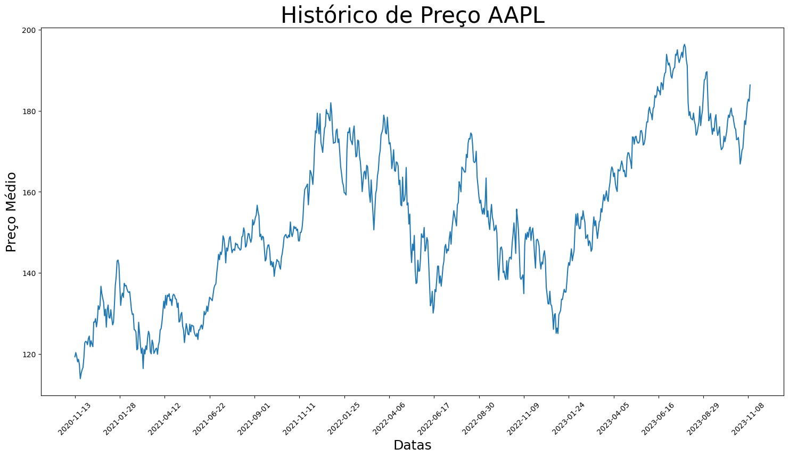
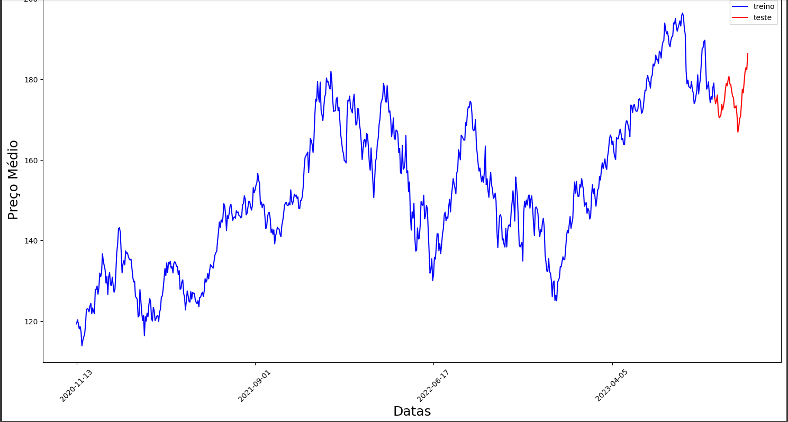
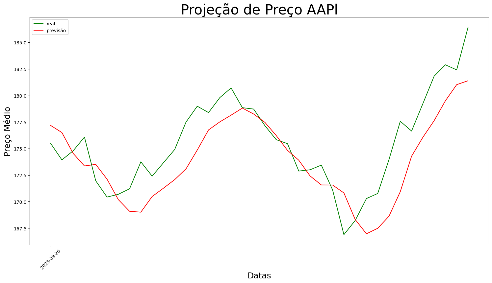
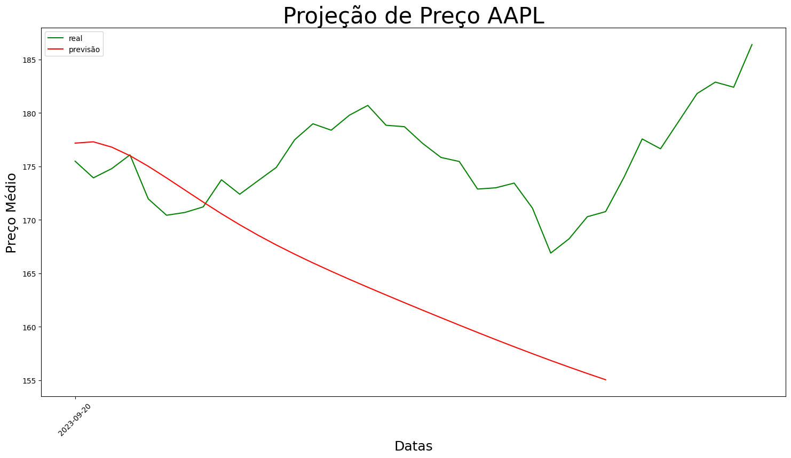

# Documentação do Projeto

Utilizamos um conjunto de dados (.csv), de diferentes organizações obtidos no [Yahoo Finance](https://finance.yahoo.com/) e com um espaço de datas pre-definida

Com base no resultado da análise desses dados, obtemos algumas previsões:

## Resultados

### Historico de Preço

### Treinamento / Teste

### Projecão de Preço "Futuro"

### Projeção da Tendência

